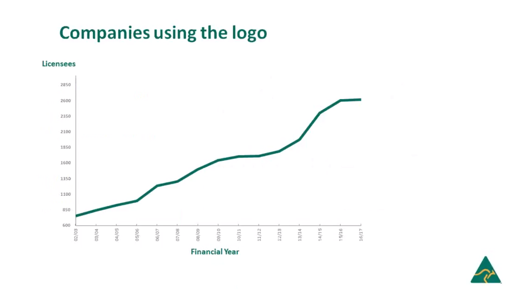

# 目前有多少会员？会员费是每年多少钱？

**目前有多少会员？**

2016年-2017月注册license数在2600到2850之间

来源：[2018年5月关于澳大利亚made驱动销售的报告.mp4](2018年5月关于澳大利亚made驱动销售的报告.mp4)

[在线观看](image/1.html)

**它要多少钱？**

网址：[https://www.australianmade.com.au/for-business/how-much-does-it-cost/](https://www.australianmade.com.au/for-business/how-much-does-it-cost/)

内容：

宣传和管理AMAG徽标的活动不是为了盈利，而是由企业为使用徽标而支付的许可费用。 该活动不是由政府资助。

年度许可费基于过去12个月许可产品的实际销售额 。最低费用为300美元加上年销售额高达300,000美元的商品及服务税。

被许可人不必提供确切的销售数字，而是要选择其营业额所属的范围。 每个范围都有固定费用。

如果产品未在市场上销售一整年，则费用将基于估算。 单击此处查看有关如何计算许多不同方案的许可费用的一些示例。

点击此处查看澳大利亚制造的澳大利亚种植标识实践守则。

目前的费用表：

|实际成交范围（$） |	费用（$）|
|:--------------|------------:|
|0 - 300,000 	|$ 300|
|> 300,000 - 500,000 |	$ 400|
|> 500,000 - 750,000| 	$ 600|
|> 750,000 - 100万 |	$ 800|
|> 100万 - 250万 |	$ 1,000|
|> 250万 - 500万 |	$ 2,500|
|> 500万 - 750万 |	$ 5,000|
|> 750万 - 1000万 |	$ 7,500|
|> 1000万--1250万 |	$ 10,000|
|> 1250万--1,500万 |	$ 12,500|
|> 1500万--1750万 |	$ 15,000|
|> 1750万 - 2000万| 	$ 17,500|
|> 2000万--3250万 	|$ 20,000|
|> 3250万--4500万 |	$ 22,500|
|超过4500万 	|$ 25,000|

所有费用均以商品及服务税表示。

如果您对费用结构有任何疑问，请致电1800 350 520或联系我们 。 
